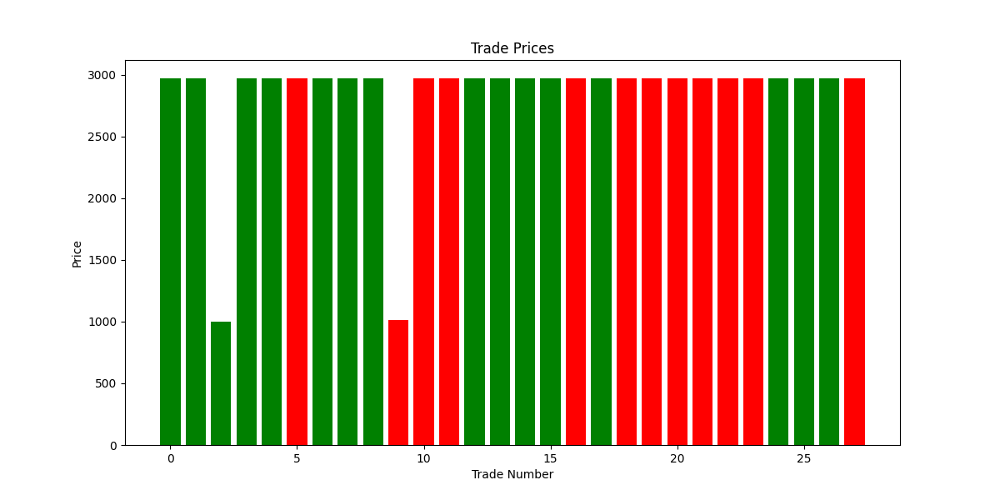

# Orderbook Delta Momentum Strategy

**Тестовое задание по торговле на основе дельты стакана ордеров (Level 2) с биржи Bybit.**
Стратегия определяет моменты входа и выхода из позиции на основе изменений объёма бидов и асков. Проект реализует полный pipeline: сбор данных → генерация сигналов → бэктест → отчёт.

## Быстрый старт

### 🔧 Установка зависимостей

```bash
pip install \
  aiohttp>=3.8.0 \
  numpy>=1.24.0 \
  websockets>=11.0.3 \
  pandas>=2.0.0 \
  pyarrow>=12.0.0 \
  matplotlib>=3.7.0 \
  python-dateutil>=2.8.2
```

### ⚙️ Конфигурация (`config.py`)

```python
# Параметры торговли
SYMBOL = "ETHUSDT"       # Торговая пара
TESTNET = True           # Использовать Bybit testnet
DELTA_THRESHOLD = 0.1    # Чувствительность сигнала 

# Настройки бэктеста
INITIAL_BALANCE = 10000  # Стартовый капитал (USD)
TRADE_QUANTITY = 0.1     # Объем сделки (ETH)
MAX_ITERATIONS = 100     # Количество тиков симуляции
```

---

## Рабочий процесс

```bash
python main.py
```

**Что происходит:**

1. Подключение к Bybit Testnet
2. Опрос стакана ордеров через REST API
3. Расчёт дельты между тик-снапшотами
4. Генерация сигналов (BUY / SELL / HOLD)
5. Виртуальное исполнение сделок
6. Финальный отчёт о результатах стратегии


## Компоненты

### Получение данных

* `bybit_client.py`, `bybit_adapter.py` — REST-интеграция с Bybit
* Сбор Level 2 данных: bids / asks
* Расчёт дельты ордербука

### Генерация сигналов

* `DeltaStrategy` — простая логика: если дельта превышает порог — BUY / SELL
* Порог задаётся в `config.py`

### Бэктест

* `Backtester` — симулятор торговли по сигналам
* Простое исполнение без проскальзывания и комиссий

### Отчёты

* `ReportGenerator` — формирует финальный отчёт и метрики

## 📁 Структура проекта

| Файл/Папка            | Назначение                          |
| --------------------- | ----------------------------------- |
| `main.py`             | Точка входа, цикл симуляции         |
| `data_service.py`     | Получение и обработка стакана       |
| `strategy_service.py` | Генерация сигналов на основе дельты |
| `backtest_service.py` | Виртуальное исполнение сделок       |
| `handlers.py`         | Обработчики команд (CQRS)           |
| `contracts.py`        | Базовая реализация паттерна CQRS    |
| `bybit_*.py`          | REST адаптеры под API Bybit         |
| `report.py`           | Генерация финальных метрик          |
| `config.py`           | Все параметры теста и торговли      |


## 🧪 Пример отчёта

```
==================== RESEARCH REPORT ====================
Strategy: Orderbook Delta Momentum
Symbol: ETHUSDT
Timeframe: N/A
Total Iterations: 100
---------------------------------------------------------
Performance Metrics:
Initial Balance: $10000.00
Final Balance:   $10250.00
Position:        0.350000 ETH
Position Value:  $1050.00
Total Value:     $11300.00
PNL:             $1300.00
Total Trades:    15
---------------------------------------------------------
Conclusion: This research demonstrates a basic strategy
based on orderbook delta momentum. The strategy showed
a profit of $1300.00 over 100 iterations.
=========================================================
```

## 📉 Визуализация сделок

Для анализа результатов каждая сделка визуализируется на графике:



* 🟩 Зелёные бары — успешные сделки (прибыльные)
* 🟥 Красные бары — убыточные
* Ось X — номер сделки
* Ось Y — цена входа

Это позволяет быстро оценить:

* Частоту входов и выходов
* Распределение прибыльных и убыточных сделок
* Консистентность стратегии

### 📄 trades_report.csv — это сырой лог всех совершённых сделок стратегии.

Каждая строка — одна сделка. В отчёте обычно содержатся такие столбцы:

| Поле        | Что означает                             |
| ----------- | ---------------------------------------- |
| timestamp | Время совершения сделки (может быть тик) |
| signal    | Сигнал, по которому вошли: BUY/SELL      |
| price     | Цена входа в сделку                      |
| position  | Направление: long / short (или 1 / -1)   |
| pnl       | Прибыль или убыток по сделке             |
| delta     | Значение дельты, вызвавшее сделку        |

Дополнительно могут быть поля вроде trade_id, position_size, exit_price, duration, но это зависит от реализации.

📌 Как используется:

* Позволяет построить график, как тот, что ты приложила (trade_prices.png)
* На его основе можно рассчитать winrate, среднюю прибыль/убыток, drawdown, и прочие метрики
* Отлично подходит для дальнейшего анализа в pandas или Excel

## Зависимости

* Python 3.8+
* `aiohttp`, `websockets` — сетевые запросы и потоки
* `numpy`, `pandas`, `pyarrow` — обработка данных
* `matplotlib`, `python-dateutil` — отчёты и графики
